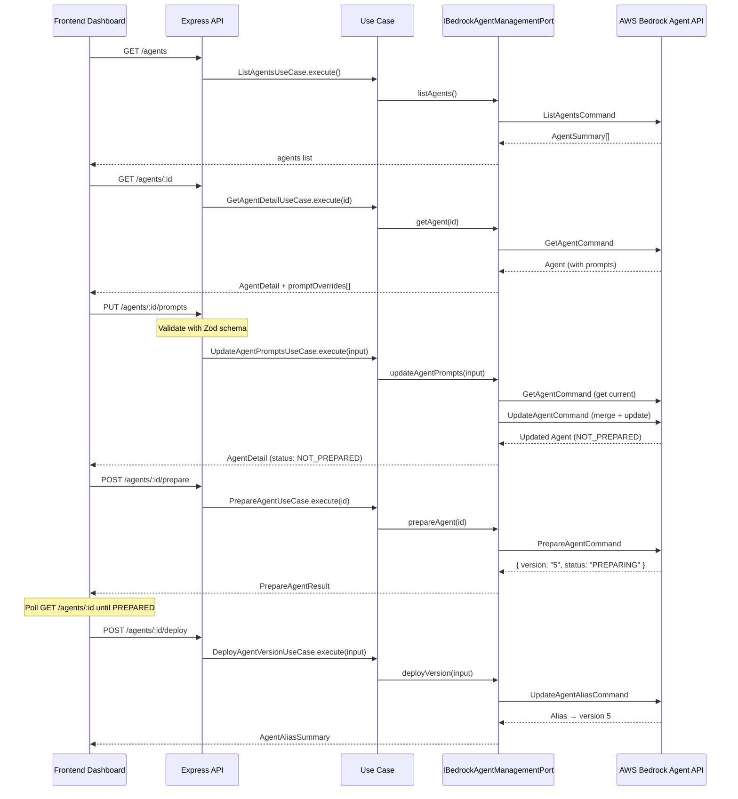

# Plan de Implementación: Bedrock Agent Management

**Feature**: Gestión dinámica de agentes Bedrock desde el dashboard  
**Fecha**: 2026-04-13  
**Complejidad**: Alta (multi-capa, AWS SDK, versionado)

---

## 1. Contexto y Problema

### Estado actual
- `BedrockAgentService` solo **consume** agentes via `InvokeAgentCommand` (runtime).
- `agentId` y `agentAliasId` se almacenan como strings opcionales en el modelo `Flow`.
- No existe forma de gestionar el ciclo de vida del agente desde el dashboard.
- Los prompts del agente (instrucciones, orquestación, pre/post-procesamiento, KB response) se configuran manualmente en la consola AWS.

### Objetivo
Permitir que cada empresa pueda, desde el dashboard:
1. **Listar** sus agentes Bedrock existentes en su cuenta AWS.
2. **Ver** el estado, versión y configuración completa de un agente.
3. **Actualizar** los prompts del agente: instrucciones + prompts de orquestación (`PRE_PROCESSING`, `ORCHESTRATION`, `KNOWLEDGE_BASE_RESPONSE_GENERATION`, `POST_PROCESSING`, `MEMORY_SUMMARIZATION`).
4. **Preparar** una nueva versión del agente (compile).
5. **Desplegar** una versión a un alias (production, staging).
6. **Asociar/desasociar** Knowledge Bases al agente.
7. **Ver historial** de versiones y deployments.

### Requisitos
- **Multi-tenant**: Cada empresa puede tener múltiples agentes con diferentes configs.
- **Tipo-agnóstico**: Soportar diferentes tipos de agentes con distintas KBs.
- **Prompt management dinámico**: Editar TODOS los prompts de la estrategia de orquestación, no solo `instruction`.
- **Config por Flow**: Cada Flow sigue apuntando a un `agentId`/`agentAliasId` — pero ahora puede gestionarlos.

---

## 2. API de AWS Bedrock Agent (Referencia)

### Comandos disponibles (`@aws-sdk/client-bedrock-agent` v3.1029.0)

| Comando | Descripción |
|---|---|
| `ListAgentsCommand` | Listar agentes de la cuenta |
| `GetAgentCommand` | Obtener detalle completo (status, prompts, config) |
| `UpdateAgentCommand` | Actualizar instrucciones, modelo, prompts de orquestación |
| `PrepareAgentCommand` | Compilar cambios → nueva versión |
| `ListAgentVersionsCommand` | Historial de versiones |
| `GetAgentVersionCommand` | Detalle de una versión |
| `ListAgentAliasesCommand` | Listar alias (production, staging) |
| `GetAgentAliasCommand` | Detalle de un alias |
| `CreateAgentAliasCommand` | Crear nuevo alias |
| `UpdateAgentAliasCommand` | Apuntar alias a versión específica |
| `AssociateAgentKnowledgeBaseCommand` | Conectar KB al agente |
| `DisassociateAgentKnowledgeBaseCommand` | Desconectar KB |
| `ListAgentKnowledgeBasesCommand` | KBs asociadas al agente |
| `UpdateAgentKnowledgeBaseCommand` | Cambiar descripción/estado de KB asociada |

### Prompt Types (orquestación)

```typescript
enum PromptType {
  PRE_PROCESSING          // Clasificación del input del usuario
  ORCHESTRATION           // Prompt principal de razonamiento/planificación
  KNOWLEDGE_BASE_RESPONSE_GENERATION  // Cómo sintetizar respuestas de la KB
  POST_PROCESSING         // Formateo final de la respuesta
  MEMORY_SUMMARIZATION    // Cómo resumir la conversación para la memoria
}
```

Cada prompt tiene:
- `promptCreationMode`: `"DEFAULT"` | `"OVERRIDDEN"` 
- `promptState`: `"ENABLED"` | `"DISABLED"`
- `basePromptTemplate`: El texto del prompt
- `inferenceConfiguration`: `{ temperature, topP, topK, maxTokens, stopSequences }`
- `foundationModel`: Modelo opcional por step

### Agent Status Lifecycle
```
NOT_PREPARED → (PrepareAgent) → PREPARING → PREPARED
PREPARED → (UpdateAgent) → UPDATING → NOT_PREPARED → (PrepareAgent) → PREPARED
```

### Alias Status
```
CREATING → PREPARED → (UpdateAlias) → UPDATING → PREPARED
```

---

## 3. Diseño de Arquitectura

### 3.1 No crear modelo Prisma para agentes

> **Decisión**: Los agentes viven en AWS, no en nuestra DB. 
> No duplicamos el estado — usamos la API de AWS como fuente de verdad.  
> Solo almacenamos la referencia (`agentId`, `agentAliasId`) en el Flow.

**Razón**: Evitar sincronización bidireccional problemática. AWS es el dueño del estado del agente.

### 3.2 Modelo de capas

```
┌─────────────────────────────────────────────────┐
│  Presentation (Controller + Routes + Schemas)   │
│  POST /agents/:id/update-prompts                │
│  POST /agents/:id/prepare                       │
│  POST /agents/:id/deploy                        │
│  GET  /agents                                   │
│  GET  /agents/:id                               │
│  GET  /agents/:id/versions                      │
│  GET  /agents/:id/aliases                       │
│  POST /agents/:id/knowledge-bases               │
│  DELETE /agents/:id/knowledge-bases/:kbId        │
├─────────────────────────────────────────────────┤
│  Application (Use Cases)                        │
│  ListAgentsUseCase                              │
│  GetAgentDetailUseCase                          │
│  UpdateAgentPromptsUseCase                      │
│  PrepareAgentUseCase                            │
│  DeployAgentVersionUseCase                      │
│  ListAgentVersionsUseCase                       │
│  ManageAgentKnowledgeBasesUseCase               │
├─────────────────────────────────────────────────┤
│  Domain (Port + Types)                          │
│  IBedrockAgentManagementPort                    │
│  AgentDetail, AgentPromptConfig, AgentVersion   │
├─────────────────────────────────────────────────┤
│  Infrastructure (Adapter)                       │
│  BedrockAgentManagementAdapter                  │
│  (usa BedrockAgentClient del SDK)               │
└─────────────────────────────────────────────────┘
```

---

## 4. Plan de Implementación

### Paso 1: Domain — Tipos e Interfaz del Port

#### 4.1.1 CREAR `src/domain/interfaces/types/bedrock-agent.type.ts`

Tipos de dominio para la gestión de agentes (sin dependencia de AWS SDK):

```typescript
// === Enums de dominio ===
export type AgentPromptType =
  | 'PRE_PROCESSING'
  | 'ORCHESTRATION'
  | 'KNOWLEDGE_BASE_RESPONSE_GENERATION'
  | 'POST_PROCESSING'
  | 'MEMORY_SUMMARIZATION';

export type AgentPromptMode = 'DEFAULT' | 'OVERRIDDEN';
export type AgentPromptState = 'ENABLED' | 'DISABLED';
export type AgentStatusType =
  | 'CREATING' | 'PREPARING' | 'PREPARED'
  | 'NOT_PREPARED' | 'UPDATING' | 'VERSIONING'
  | 'DELETING' | 'FAILED';

// === Tipos compuestos ===
export interface AgentPromptConfig {
  promptType: AgentPromptType;
  promptCreationMode: AgentPromptMode;
  promptState: AgentPromptState;
  basePromptTemplate: string;
  inferenceConfig?: {
    temperature?: number;
    topP?: number;
    topK?: number;
    maxTokens?: number;
    stopSequences?: string[];
  };
  foundationModel?: string;  // modelo opcional por step
}

export interface AgentDetail {
  agentId: string;
  agentName: string;
  description?: string;
  status: AgentStatusType;
  foundationModel?: string;
  instruction?: string;
  orchestrationType?: 'DEFAULT' | 'CUSTOM_ORCHESTRATION';
  promptOverrides: AgentPromptConfig[];
  idleSessionTTLInSeconds: number;
  createdAt: Date;
  updatedAt: Date;
  preparedAt?: Date;
  failureReasons?: string[];
  recommendedActions?: string[];
}

export interface AgentSummary {
  agentId: string;
  agentName: string;
  description?: string;
  status: AgentStatusType;
  updatedAt: Date;
}

export interface AgentVersionSummary {
  agentId: string;
  version: string;
  agentName: string;
  status: AgentStatusType;
  description?: string;
  createdAt: Date;
  updatedAt: Date;
}

export interface AgentAliasSummary {
  agentAliasId: string;
  agentAliasName: string;
  description?: string;
  status: string;
  routingConfig: Array<{ agentVersion: string }>;
  createdAt: Date;
  updatedAt: Date;
}

export interface AgentKnowledgeBaseSummary {
  knowledgeBaseId: string;
  description: string;
  state: 'ENABLED' | 'DISABLED';
  updatedAt: Date;
}

// === Inputs para operaciones ===
export interface UpdateAgentPromptsInput {
  agentId: string;
  instruction?: string;
  foundationModel?: string;
  description?: string;
  idleSessionTTLInSeconds?: number;
  promptOverrides?: AgentPromptConfig[];
}

export interface DeployAgentInput {
  agentId: string;
  agentAliasId: string;
  agentVersion: string;    // versión a desplegar
  description?: string;
}

export interface PrepareAgentResult {
  agentId: string;
  agentVersion: string;    // nueva versión creada
  status: AgentStatusType;
  preparedAt: Date;
}

export interface AssociateKBInput {
  agentId: string;
  agentVersion: string;    // typically "DRAFT"
  knowledgeBaseId: string;
  description: string;
}
```

#### 4.1.2 CREAR `src/domain/interfaces/ports/ibedrock-agent-management.port.ts`

```typescript
import type {
  AgentDetail,
  AgentSummary,
  AgentVersionSummary,
  AgentAliasSummary,
  AgentKnowledgeBaseSummary,
  UpdateAgentPromptsInput,
  PrepareAgentResult,
  DeployAgentInput,
  AssociateKBInput,
} from '../types/bedrock-agent.type';

export interface IBedrockAgentManagementPort {
  // === Consulta ===
  listAgents(): Promise<AgentSummary[]>;
  getAgent(agentId: string): Promise<AgentDetail>;
  listVersions(agentId: string): Promise<AgentVersionSummary[]>;
  listAliases(agentId: string): Promise<AgentAliasSummary[]>;

  // === Mutación ===
  updateAgentPrompts(input: UpdateAgentPromptsInput): Promise<AgentDetail>;
  prepareAgent(agentId: string): Promise<PrepareAgentResult>;
  deployVersion(input: DeployAgentInput): Promise<AgentAliasSummary>;

  // === Knowledge Base association ===
  listAgentKnowledgeBases(agentId: string): Promise<AgentKnowledgeBaseSummary[]>;
  associateKnowledgeBase(input: AssociateKBInput): Promise<void>;
  disassociateKnowledgeBase(agentId: string, knowledgeBaseId: string): Promise<void>;
}
```

**Notas de implementación:**
- El port NO conoce AWS SDK — tipos puros de dominio.
- `updateAgentPrompts` recibe un array de `AgentPromptConfig` que el adapter mapea a `PromptOverrideConfiguration`.
- `getAgent` devuelve los prompts actuales INCLUYENDO los de orquestación.

---

### Paso 2: Application — Use Cases

#### 4.2.1 CREAR `src/app/use-cases/bedrock-agent/list-agents.use-case.ts`

```typescript
@injectable()
export class ListAgentsUseCase {
  constructor(
    @inject(DI.BedrockAgentManagementPort)
    private readonly agentPort: IBedrockAgentManagementPort,
  ) {}

  async execute(): Promise<AgentSummary[]> {
    return this.agentPort.listAgents();
  }
}
```

#### 4.2.2 CREAR `src/app/use-cases/bedrock-agent/get-agent-detail.use-case.ts`

```typescript
@injectable()
export class GetAgentDetailUseCase {
  constructor(
    @inject(DI.BedrockAgentManagementPort)
    private readonly agentPort: IBedrockAgentManagementPort,
  ) {}

  async execute(agentId: string): Promise<AgentDetail> {
    return this.agentPort.getAgent(agentId);
  }
}
```

#### 4.2.3 CREAR `src/app/use-cases/bedrock-agent/update-agent-prompts.use-case.ts`

Este es el **use case principal** — permite editar instrucciones + todos los prompts de orquestación.

```typescript
@injectable()
export class UpdateAgentPromptsUseCase {
  constructor(
    @inject(DI.BedrockAgentManagementPort)
    private readonly agentPort: IBedrockAgentManagementPort,
  ) {}

  async execute(input: UpdateAgentPromptsInput): Promise<AgentDetail> {
    return this.agentPort.updateAgentPrompts(input);
  }
}
```

#### 4.2.4 CREAR `src/app/use-cases/bedrock-agent/prepare-agent.use-case.ts`

```typescript
@injectable()
export class PrepareAgentUseCase {
  constructor(
    @inject(DI.BedrockAgentManagementPort)
    private readonly agentPort: IBedrockAgentManagementPort,
  ) {}

  async execute(agentId: string): Promise<PrepareAgentResult> {
    return this.agentPort.prepareAgent(agentId);
  }
}
```

#### 4.2.5 CREAR `src/app/use-cases/bedrock-agent/deploy-agent-version.use-case.ts`

```typescript
@injectable()
export class DeployAgentVersionUseCase {
  constructor(
    @inject(DI.BedrockAgentManagementPort)
    private readonly agentPort: IBedrockAgentManagementPort,
  ) {}

  async execute(input: DeployAgentInput): Promise<AgentAliasSummary> {
    return this.agentPort.deployVersion(input);
  }
}
```

#### 4.2.6 CREAR `src/app/use-cases/bedrock-agent/list-agent-versions.use-case.ts`

```typescript
@injectable()
export class ListAgentVersionsUseCase {
  constructor(
    @inject(DI.BedrockAgentManagementPort)
    private readonly agentPort: IBedrockAgentManagementPort,
  ) {}

  async execute(agentId: string): Promise<AgentVersionSummary[]> {
    return this.agentPort.listVersions(agentId);
  }
}
```

#### 4.2.7 CREAR `src/app/use-cases/bedrock-agent/manage-agent-kb.use-case.ts`

```typescript
@injectable()
export class ManageAgentKnowledgeBasesUseCase {
  constructor(
    @inject(DI.BedrockAgentManagementPort)
    private readonly agentPort: IBedrockAgentManagementPort,
  ) {}

  async listKnowledgeBases(agentId: string) {
    return this.agentPort.listAgentKnowledgeBases(agentId);
  }

  async associate(input: AssociateKBInput) {
    return this.agentPort.associateKnowledgeBase(input);
  }

  async disassociate(agentId: string, knowledgeBaseId: string) {
    return this.agentPort.disassociateKnowledgeBase(agentId, knowledgeBaseId);
  }
}
```

---

### Paso 3: Infrastructure — Adapter AWS

#### 4.3.1 CREAR `src/infraestructure/services/bedrock-agent/bedrock-agent-management.adapter.ts`

Este es el componente más complejo. Implementa `IBedrockAgentManagementPort` usando `BedrockAgentClient`.

**Imports necesarios:**
```typescript
import {
  BedrockAgentClient,
  ListAgentsCommand,
  GetAgentCommand,
  UpdateAgentCommand,
  PrepareAgentCommand,
  ListAgentVersionsCommand,
  ListAgentAliasesCommand,
  UpdateAgentAliasCommand,
  AssociateAgentKnowledgeBaseCommand,
  DisassociateAgentKnowledgeBaseCommand,
  ListAgentKnowledgeBasesCommand,
  type Agent,
  type PromptConfiguration,
  type PromptOverrideConfiguration,
  PromptType,
  CreationMode,
  PromptState,
} from "@aws-sdk/client-bedrock-agent";
```

**Puntos clave de implementación:**

1. **Cliente singleton** con region configurable (reusar el patrón de `s3-bedrock-target.adapter.ts`)
2. **Mapper privado** `mapAgentToDetail(agent: Agent): AgentDetail` — convierte tipos AWS a tipos de dominio
3. **Mapper privado** `mapPromptConfigsToOverride(configs: AgentPromptConfig[]): PromptOverrideConfiguration` — convierte prompts de dominio a formato AWS
4. **`updateAgentPrompts`** requiere pasar `agentResourceRoleArn` y `foundationModel` obligatorios — obtenerlos del `GetAgentCommand` previo si no se proporcionan
5. **Error handling**: Usar `ErrorFactory.throwError()` para mapear errores de AWS:
   - `ResourceNotFoundException` → `not-found`
   - `ConflictException` → `conflict` (agente en estado no preparado)
   - `ValidationException` → `bad-request`
   - Otros → `internal-error`

**Notas críticas para el implementador:**
- `UpdateAgentCommand` requiere los campos `agentName`, `foundationModel` y `agentResourceRoleArn` **OBLIGATORIOS**. Si el usuario solo quiere cambiar el prompt, el adapter debe primero hacer `GetAgent` para obtener los valores actuales y pasarlos de vuelta.
- Los `promptOverrides` se pasan como `PromptOverrideConfiguration` que contiene un array de `PromptConfiguration[]`. Cada paso de orquestación se identifica con `promptType`.
- Después de `UpdateAgent`, el agente queda en estado `NOT_PREPARED`. El frontend debe llamar a `PrepareAgent` explícitamente.

---

### Paso 4: Presentation — Schemas, Controller, Routes

#### 4.4.1 CREAR `src/infraestructure/http/controllers/schemas/bedrock-agent.schema.ts`

```typescript
import { z } from 'zod/v4';

const AgentPromptConfigSchema = z.object({
  promptType: z.enum([
    'PRE_PROCESSING',
    'ORCHESTRATION',
    'KNOWLEDGE_BASE_RESPONSE_GENERATION',
    'POST_PROCESSING',
    'MEMORY_SUMMARIZATION',
  ]),
  promptCreationMode: z.enum(['DEFAULT', 'OVERRIDDEN']),
  promptState: z.enum(['ENABLED', 'DISABLED']),
  basePromptTemplate: z.string().min(1).max(100000),
  inferenceConfig: z.object({
    temperature: z.number().min(0).max(1).optional(),
    topP: z.number().min(0).max(1).optional(),
    topK: z.number().int().min(0).max(500).optional(),
    maxTokens: z.number().int().min(1).max(100000).optional(),
    stopSequences: z.array(z.string()).optional(),
  }).optional(),
  foundationModel: z.string().optional(),
});

export const UpdateAgentPromptsSchema = z.object({
  instruction: z.string().min(1).max(50000).optional(),
  foundationModel: z.string().optional(),
  description: z.string().max(500).optional(),
  idleSessionTTLInSeconds: z.number().int().min(60).max(3600).optional(),
  promptOverrides: z.array(AgentPromptConfigSchema).max(5).optional(),
});

export const DeployAgentVersionSchema = z.object({
  agentAliasId: z.string().min(1),
  agentVersion: z.string().min(1),
  description: z.string().max(500).optional(),
});

export const AssociateKBSchema = z.object({
  knowledgeBaseId: z.string().min(1),
  description: z.string().min(1).max(500),
  agentVersion: z.string().default('DRAFT'),
});
```

#### 4.4.2 CREAR `src/infraestructure/http/controllers/bedrock-agent/bedrock-agent.controller.ts`

```typescript
@injectable()
export class BedrockAgentController {
  constructor(
    @inject(DI.ListAgentsUseCase)
    private readonly listAgentsUC: ListAgentsUseCase,
    @inject(DI.GetAgentDetailUseCase)
    private readonly getAgentDetailUC: GetAgentDetailUseCase,
    @inject(DI.UpdateAgentPromptsUseCase)
    private readonly updatePromptsUC: UpdateAgentPromptsUseCase,
    @inject(DI.PrepareAgentUseCase)
    private readonly prepareAgentUC: PrepareAgentUseCase,
    @inject(DI.DeployAgentVersionUseCase)
    private readonly deployVersionUC: DeployAgentVersionUseCase,
    @inject(DI.ListAgentVersionsUseCase)
    private readonly listVersionsUC: ListAgentVersionsUseCase,
    @inject(DI.ManageAgentKBUseCase)
    private readonly manageKBUC: ManageAgentKnowledgeBasesUseCase,
  ) {}

  // GET /agents
  async listAgents(req, res) { ... }

  // GET /agents/:agentId
  async getAgent(req, res) { ... }

  // PUT /agents/:agentId/prompts
  async updatePrompts(req, res) {
    // Validate with UpdateAgentPromptsSchema
    // Call updatePromptsUC.execute({ agentId: req.params.agentId, ...body })
    // ResponseBuilder.sendSuccess / SuccessFactory
  }

  // POST /agents/:agentId/prepare
  async prepare(req, res) { ... }

  // POST /agents/:agentId/deploy
  async deploy(req, res) {
    // Validate with DeployAgentVersionSchema
    // Call deployVersionUC.execute({ agentId, ...body })
  }

  // GET /agents/:agentId/versions
  async listVersions(req, res) { ... }

  // GET /agents/:agentId/aliases
  async listAliases(req, res) { ... }

  // GET /agents/:agentId/knowledge-bases
  async listKnowledgeBases(req, res) { ... }

  // POST /agents/:agentId/knowledge-bases
  async associateKB(req, res) { ... }

  // DELETE /agents/:agentId/knowledge-bases/:kbId
  async disassociateKB(req, res) { ... }
}
```

#### 4.4.3 CREAR `src/infraestructure/http/routes/bedrock-agent/bedrock-agent.routes.ts`

```typescript
// GET    /agents                          → listAgents
// GET    /agents/:agentId                 → getAgent
// PUT    /agents/:agentId/prompts         → updatePrompts
// POST   /agents/:agentId/prepare         → prepare
// POST   /agents/:agentId/deploy          → deploy
// GET    /agents/:agentId/versions        → listVersions
// GET    /agents/:agentId/aliases         → listAliases
// GET    /agents/:agentId/knowledge-bases → listKnowledgeBases
// POST   /agents/:agentId/knowledge-bases → associateKB
// DELETE /agents/:agentId/knowledge-bases/:kbId → disassociateKB
```

Todos los endpoints requieren autenticación (`authMiddleware`).

---

### Paso 5: DI — Tokens y Módulo

#### 4.5.1 MODIFICAR `src/infraestructure/DI/tokens.ts`

Agregar tokens:
```typescript
BedrockAgentManagementPort: Symbol.for('BedrockAgentManagementPort'),
ListAgentsUseCase: Symbol.for('ListAgentsUseCase'),
GetAgentDetailUseCase: Symbol.for('GetAgentDetailUseCase'),
UpdateAgentPromptsUseCase: Symbol.for('UpdateAgentPromptsUseCase'),
PrepareAgentUseCase: Symbol.for('PrepareAgentUseCase'),
DeployAgentVersionUseCase: Symbol.for('DeployAgentVersionUseCase'),
ListAgentVersionsUseCase: Symbol.for('ListAgentVersionsUseCase'),
ManageAgentKBUseCase: Symbol.for('ManageAgentKBUseCase'),
```

#### 4.5.2 CREAR `src/infraestructure/DI/modules/bedrock-agent.module.ts`

```typescript
export function registerBedrockAgentModule(container: DependencyContainer): void {
  // Port → Adapter
  container.registerSingleton<IBedrockAgentManagementPort>(
    DI.BedrockAgentManagementPort,
    BedrockAgentManagementAdapter,
  );

  // Use Cases
  container.register(DI.ListAgentsUseCase, ListAgentsUseCase);
  container.register(DI.GetAgentDetailUseCase, GetAgentDetailUseCase);
  container.register(DI.UpdateAgentPromptsUseCase, UpdateAgentPromptsUseCase);
  container.register(DI.PrepareAgentUseCase, PrepareAgentUseCase);
  container.register(DI.DeployAgentVersionUseCase, DeployAgentVersionUseCase);
  container.register(DI.ListAgentVersionsUseCase, ListAgentVersionsUseCase);
  container.register(DI.ManageAgentKBUseCase, ManageAgentKnowledgeBasesUseCase);
}
```

#### 4.5.3 MODIFICAR `src/infraestructure/DI/container.ts`

Importar y llamar `registerBedrockAgentModule(container)`.

#### 4.5.4 MODIFICAR `src/infraestructure/http/routes/index.ts`

Registrar la ruta:
```typescript
router.use('/agents', bedrockAgentRoutes);
```

---

### Paso 6: Documentación

#### 4.6.1 MODIFICAR `ai-specs/specs/api-spec.yml`

Agregar los 10 endpoints bajo el tag `BedrockAgents`.

#### 4.6.2 NO se modifica `schema.prisma`

No se necesita migration porque los agentes viven en AWS. Solo se usan las refs existentes en Flow (`agentId`, `agentAliasId`).

---

## 5. Flujos de Usuario

### 5.1 Editar prompts de un agente

```
Dashboard: GET /agents/:agentId
  → Muestra instrucciones + 5 prompt types con sus templates actuales

Dashboard: PUT /agents/:agentId/prompts
  Body: {
    instruction: "Eres un asistente de ventas...",
    promptOverrides: [
      {
        promptType: "ORCHESTRATION",
        promptCreationMode: "OVERRIDDEN",
        promptState: "ENABLED",
        basePromptTemplate: "System: You are an orchestrator...\n$instruction$\n..."
      },
      {
        promptType: "KNOWLEDGE_BASE_RESPONSE_GENERATION",
        promptCreationMode: "OVERRIDDEN",
        promptState: "ENABLED",
        basePromptTemplate: "Given these search results: $search_results$\n..."
      }
    ]
  }
  → Retorna: agent detail actualizado (status: NOT_PREPARED)

Dashboard: POST /agents/:agentId/prepare
  → Retorna: { agentVersion: "5", status: "PREPARING" }
  → Frontend hace polling en GET /agents/:agentId hasta status="PREPARED"

Dashboard: POST /agents/:agentId/deploy
  Body: { agentAliasId: "PROD_ALIAS", agentVersion: "5" }
  → Retorna: alias actualizado apuntando a versión 5
```

### 5.2 Asociar una Knowledge Base

```
Dashboard: GET /agents/:agentId/knowledge-bases
  → Lista KBs actualmente asociadas

Dashboard: POST /agents/:agentId/knowledge-bases
  Body: {
    knowledgeBaseId: "KB-123",
    description: "Catálogo de productos MesDessous",
    agentVersion: "DRAFT"
  }

Dashboard: POST /agents/:agentId/prepare  (recompilar)
Dashboard: POST /agents/:agentId/deploy   (desplegar)
```

---

## 6. Archivos a Crear/Modificar

### Archivos nuevos (12)

| Archivo | Capa |
|---|---|
| `src/domain/interfaces/types/bedrock-agent.type.ts` | Domain |
| `src/domain/interfaces/ports/ibedrock-agent-management.port.ts` | Domain |
| `src/app/use-cases/bedrock-agent/list-agents.use-case.ts` | App |
| `src/app/use-cases/bedrock-agent/get-agent-detail.use-case.ts` | App |
| `src/app/use-cases/bedrock-agent/update-agent-prompts.use-case.ts` | App |
| `src/app/use-cases/bedrock-agent/prepare-agent.use-case.ts` | App |
| `src/app/use-cases/bedrock-agent/deploy-agent-version.use-case.ts` | App |
| `src/app/use-cases/bedrock-agent/list-agent-versions.use-case.ts` | App |
| `src/app/use-cases/bedrock-agent/manage-agent-kb.use-case.ts` | App |
| `src/infraestructure/services/bedrock-agent/bedrock-agent-management.adapter.ts` | Infra |
| `src/infraestructure/http/controllers/bedrock-agent/bedrock-agent.controller.ts` | Infra |
| `src/infraestructure/http/controllers/schemas/bedrock-agent.schema.ts` | Infra |
| `src/infraestructure/http/routes/bedrock-agent/bedrock-agent.routes.ts` | Infra |
| `src/infraestructure/DI/modules/bedrock-agent.module.ts` | Infra |

### Archivos modificados (3)

| Archivo | Cambio |
|---|---|
| `src/infraestructure/DI/tokens.ts` | Agregar 8 tokens |
| `src/infraestructure/DI/container.ts` | Importar y registrar módulo |
| `src/infraestructure/http/routes/index.ts` | Montar `/agents` |

### Documentación (1)

| Archivo | Cambio |
|---|---|
| `ai-specs/specs/api-spec.yml` | 10 nuevos endpoints + schemas |

---

## 7. Commits Sugeridos

| # | Mensaje | Archivos |
|---|---|---|
| 1 | `feat(domain): add bedrock agent management port and types` | domain types + port |
| 2 | `feat(agent): add bedrock agent management use cases` | 7 use case files |
| 3 | `feat(agent): add bedrock agent management adapter` | adapter + error mapping |
| 4 | `feat(api): add bedrock agent management endpoints` | schemas, controller, routes |
| 5 | `chore(di): register bedrock agent management module` | tokens, module, container, routes index |
| 6 | `docs(specs): add bedrock agent management endpoints to api-spec` | api-spec.yml |

---

## 8. Notas Importantes para el Implementador

### ⚠️ `UpdateAgentCommand` requiere campos obligatorios

`agentName`, `foundationModel` y `agentResourceRoleArn` son **required**. El adapter DEBE hacer `GetAgent` primero para obtener estos valores si el usuario solo envía `instruction` o `promptOverrides`.

```typescript
async updateAgentPrompts(input: UpdateAgentPromptsInput): Promise<AgentDetail> {
  // 1. Obtener estado actual
  const current = await this.client.send(new GetAgentCommand({ agentId: input.agentId }));
  const agent = current.agent!;

  // 2. Merge con input del usuario
  const command = new UpdateAgentCommand({
    agentId: input.agentId,
    agentName: agent.agentName!,                          // preserve
    agentResourceRoleArn: agent.agentResourceRoleArn!,    // preserve
    foundationModel: input.foundationModel ?? agent.foundationModel!,
    instruction: input.instruction ?? agent.instruction,
    description: input.description ?? agent.description,
    idleSessionTTLInSeconds: input.idleSessionTTLInSeconds ?? agent.idleSessionTTLInSeconds,
    promptOverrideConfiguration: input.promptOverrides
      ? this.mapToPromptOverride(input.promptOverrides)
      : agent.promptOverrideConfiguration,
  });

  const result = await this.client.send(command);
  return this.mapAgentToDetail(result.agent!);
}
```

### ⚠️ Prompt templates soportan variables de AWS

Los templates de Bedrock usan placeholders. Ejemplo de Orchestration:
- `$instruction$` — instrucciones del agente
- `$agent_scratchpad$` — razonamiento del agente
- `$output_format_instructions$` — formato de output
- `$search_results$` — resultados de KB (en KB_RESPONSE_GENERATION)

El frontend DEBERÍA mostrar documentación sobre los placeholders disponibles por `promptType`.

### ⚠️ El agente necesita `PrepareAgent` después de cualquier cambio

Después de `UpdateAgent`, el status pasa a `NOT_PREPARED`. El agente **SIGUE funcionando** con la versión anterior, pero los cambios no se aplican hasta hacer `PrepareAgent` + `UpdateAlias`.

### ⚠️ No es necesario un modelo Prisma para esto

Los agentes son recursos de AWS. NO los duplicamos en la DB. El Flow ya tiene `agentId` y `agentAliasId` como campos de texto. El frontend puede usar `GET /agents` para listar los disponibles y vincularlos a un Flow.

### ⚠️ Credenciales AWS

El adapter usa las mismas credenciales que ya existen (`AWS_ACCESS_KEY_ID`, `AWS_SECRET_ACCESS_KEY`, `AWS_BEDROCK_AGENT_REGION`). No se necesitan nuevas env vars.

### ⚠️ Rate limits de Bedrock API

`PrepareAgent` puede tardar 10-30 segundos. El endpoint DEBERÍA retornar inmediatamente con `status: "PREPARING"` y el frontend hace polling con `GET /agents/:id` hasta `status: "PREPARED"`.

---

## 9. Tests Sugeridos (Vitest)

### Unit Tests

| Test File | Qué testea |
|---|---|
| `test/app/use-cases/bedrock-agent/update-agent-prompts.use-case.test.ts` | Que el UC delega correctamente al port |
| `test/app/use-cases/bedrock-agent/deploy-agent-version.use-case.test.ts` | Que el UC pasa los params correctos |
| `test/infraestructure/services/bedrock-agent/bedrock-agent-management.adapter.test.ts` | Mappers AWS ↔ Domain, error handling |

### Patrón de test

```typescript
describe('UpdateAgentPromptsUseCase', () => {
  it('should call port.updateAgentPrompts with input', async () => {
    const port = { updateAgentPrompts: vi.fn().mockResolvedValue(mockDetail) };
    const uc = new UpdateAgentPromptsUseCase(port);

    const result = await uc.execute({ agentId: 'test', instruction: 'new' });

    expect(port.updateAgentPrompts).toHaveBeenCalledWith({ agentId: 'test', instruction: 'new' });
    expect(result).toEqual(mockDetail);
  });
});
```

Para el adapter, mockear `BedrockAgentClient.send()` con `aws-sdk-client-mock`.

---

## 10. Diagrama de Flujo Completo


