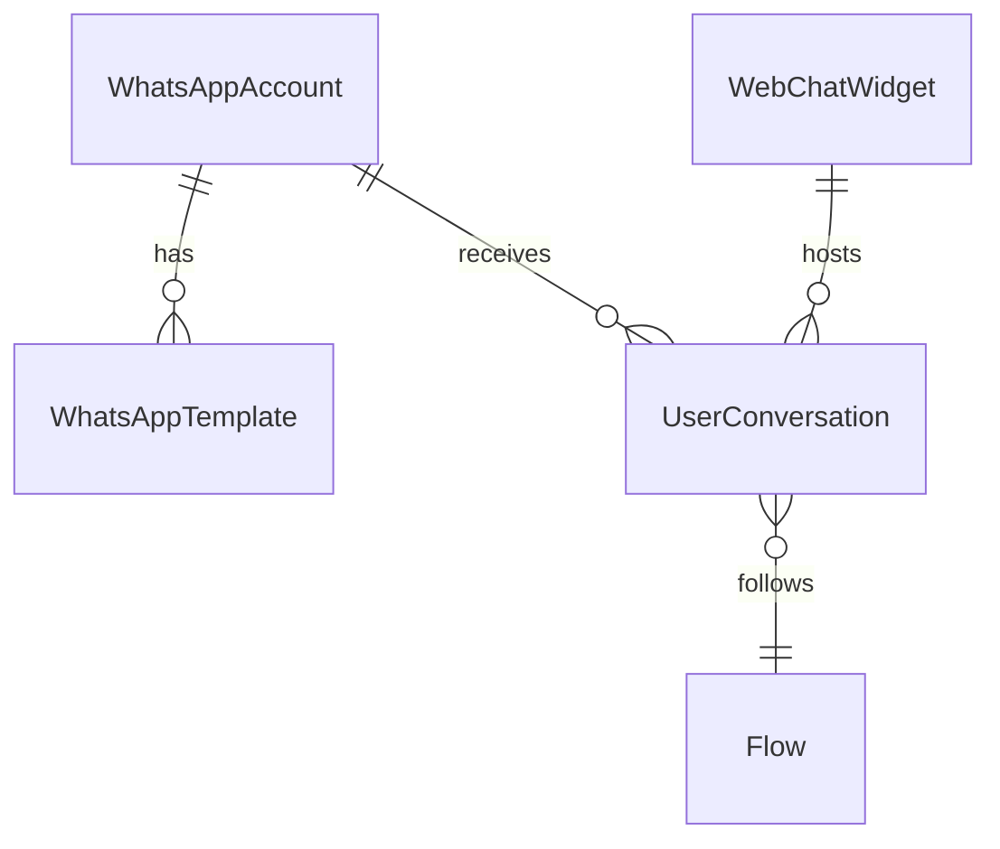

# PASO 2: Multi-Canal Domain Layer + Migration

## 🎯 Objetivo

Completar la migración de base de datos pendiente y construir la capa de **dominio e infraestructura** para los dos nuevos modelos del sistema multi-canal:

- `WhatsAppAccount` — gestión de múltiples líneas de WhatsApp
- `WebChatWidget` — gestión de múltiples widgets de WebChat

El schema ya tiene estos modelos definidos pero **ninguna migración fue aplicada** y no existen entidades de dominio, interfaces de repositorio ni implementaciones Prisma para ellos.

---

## ⚠️ Estado Actual del Proyecto

| Componente | Estado |
|---|---|
| `schema.prisma` — modelos `WhatsAppAccount`, `WebChatWidget` | ✅ Definidos |
| Migración en BD | ❌ Sin aplicar (drift) |
| `UserConversation.whatsappAccountId` / `widgetId` | ✅ En schema, ❌ Sin migración |
| `WhatsAppAccountEntity` | ❌ No existe |
| `WebChatWidgetEntity` | ❌ No existe |
| `IWhatsAppAccountRepository` | ❌ No existe |
| `IWebChatWidgetRepository` | ❌ No existe |
| `PrismaWhatsAppAccountRepository` | ❌ No existe (solo stub vacío) |
| `PrismaWebChatWidgetRepository` | ❌ No existe |
| `WidgetConfigController.getConfig()` | ⚠️ Config hardcodeada (temporal) |
| `ProcessIncomingMessageUseCase` | ⚠️ No pasa `widgetId` al crear conversación |
| `data-model.md` | ⚠️ Sin `WhatsAppAccount`, `WebChatWidget` |

---

## 📦 Archivos a Crear / Modificar

### GRUPO A — Migración (hacer primero, bloquea todo lo demás)

#### Paso A1 — Aplicar migración pendiente

El schema tiene cambios sin migración. La causa del error `npx prisma migrate dev --create-only --name "multi-channel-breaking-changes"` es un **drift de schema** (tablas de Prisma ya existen en la BD o el estado interno no coincide).

**Diagnóstico previo:**
```bash
npx prisma migrate status
```

**Si muestra drift, resolver con:**
```bash
npx prisma migrate dev --name "add-multi-channel-whatsapp-webchat"
```

> ⚠️ **NOTA IMPORTANTE**: No usar `--force-reset` ni `prisma db push`. Si hay conflicto de drift, usar `npx prisma migrate resolve --applied <migration_name>`.

**Resultado esperado:** Nueva carpeta en `prisma/migrations/` con el SQL que crea:
- `whatsapp_accounts`
- `webchat_widgets`
- Columnas `whatsappAccountId` y `widgetId` en `user_conversation`
- Índices correspondientes

---

### GRUPO B — Domain Layer (ejecutar después de A1)

#### Archivo B1: `src/domain/entities/whatsapp-account.entity.ts` — CREAR

```typescript
import { Entity, UUID } from "../common";

export interface WhatsAppAccountProps {
  name: string;
  slug: string;
  description?: string;
  phoneNumberId: string;
  accessToken: string;       // AES-256 encriptado en infra
  businessId: string;
  apiVersion?: string;
  webhookUrl?: string;
  webhookVerifyToken?: string;
  isPrimary?: boolean;
  isActive?: boolean;
  metadata?: Record<string, unknown>;
  createdAt?: Date;
  updatedAt?: Date;
}

export class WhatsAppAccountEntity extends Entity<WhatsAppAccountProps> {
  private constructor(props: WhatsAppAccountProps, id?: UUID) {
    super(
      {
        ...props,
        apiVersion: props.apiVersion ?? "v21.0",
        isPrimary: props.isPrimary ?? false,
        isActive: props.isActive ?? true,
        metadata: props.metadata ?? {},
        createdAt: props.createdAt ?? new Date(),
        updatedAt: props.updatedAt ?? new Date(),
      },
      id,
    );
  }

  static create(
    props: Omit<WhatsAppAccountProps, "createdAt" | "updatedAt">,
  ): WhatsAppAccountEntity {
    return new WhatsAppAccountEntity(props);
  }

  static reconstitute(props: WhatsAppAccountProps, id: UUID): WhatsAppAccountEntity {
    return new WhatsAppAccountEntity(props, id);
  }

  // Getters
  get name(): string { return this.props.name; }
  get slug(): string { return this.props.slug; }
  get phoneNumberId(): string { return this.props.phoneNumberId; }
  get accessToken(): string { return this.props.accessToken; }
  get businessId(): string { return this.props.businessId; }
  get apiVersion(): string { return this.props.apiVersion!; }
  get isPrimary(): boolean { return this.props.isPrimary!; }
  get isActive(): boolean { return this.props.isActive!; }
  get description(): string | undefined { return this.props.description; }
  get webhookUrl(): string | undefined { return this.props.webhookUrl; }
  get webhookVerifyToken(): string | undefined { return this.props.webhookVerifyToken; }
  get metadata(): Record<string, unknown> { return this.props.metadata!; }
  get createdAt(): Date { return this.props.createdAt!; }
  get updatedAt(): Date { return this.props.updatedAt!; }
}
```

> **Builder obligatorio**: >5 atributos → `WhatsAppAccountBuilder` (ver B2).

---

#### Archivo B2: `src/domain/builders/whatsapp-account.builder.ts` — CREAR

```typescript
import { WhatsAppAccountEntity, WhatsAppAccountProps } from "../entities/whatsapp-account.entity";
import { ErrorFactory } from "../exceptions";
import { UUID } from "../common";

export class WhatsAppAccountBuilder {
  private props: Partial<WhatsAppAccountProps> = {
    apiVersion: "v21.0",
    isPrimary: false,
    isActive: true,
    metadata: {},
  };
  private id?: UUID;

  setId(id: UUID): this {
    this.id = id;
    return this;
  }

  setName(name: string): this {
    if (!name?.trim()) throw ErrorFactory.create("validation-failed", "El nombre es requerido");
    this.props.name = name.trim();
    return this;
  }

  setSlug(slug: string): this {
    if (!slug?.trim()) throw ErrorFactory.create("validation-failed", "El slug es requerido");
    if (!/^[a-z0-9-]+$/.test(slug)) {
      throw ErrorFactory.create("validation-failed", "El slug solo puede contener letras minúsculas, números y guiones");
    }
    this.props.slug = slug.trim();
    return this;
  }

  setPhoneNumberId(phoneNumberId: string): this {
    if (!phoneNumberId?.trim()) throw ErrorFactory.create("validation-failed", "El phoneNumberId es requerido");
    this.props.phoneNumberId = phoneNumberId.trim();
    return this;
  }

  setAccessToken(token: string): this {
    if (!token?.trim()) throw ErrorFactory.create("validation-failed", "El access token es requerido");
    this.props.accessToken = token.trim();
    return this;
  }

  setBusinessId(businessId: string): this {
    if (!businessId?.trim()) throw ErrorFactory.create("validation-failed", "El businessId es requerido");
    this.props.businessId = businessId.trim();
    return this;
  }

  setApiVersion(version: string): this { this.props.apiVersion = version; return this; }
  setDescription(desc: string): this { this.props.description = desc; return this; }
  setWebhookUrl(url: string): this { this.props.webhookUrl = url; return this; }
  setWebhookVerifyToken(token: string): this { this.props.webhookVerifyToken = token; return this; }
  setPrimary(isPrimary: boolean): this { this.props.isPrimary = isPrimary; return this; }
  setActive(isActive: boolean): this { this.props.isActive = isActive; return this; }
  setMetadata(metadata: Record<string, unknown>): this { this.props.metadata = metadata; return this; }
  setTimestamps(createdAt: Date, updatedAt: Date): this {
    this.props.createdAt = createdAt;
    this.props.updatedAt = updatedAt;
    return this;
  }

  build(): WhatsAppAccountEntity {
    const required = ["name", "slug", "phoneNumberId", "accessToken", "businessId"];
    for (const field of required) {
      if (!(this.props as any)[field]) {
        throw ErrorFactory.create("validation-failed", `El campo "${field}" es requerido`);
      }
    }
    return this.id
      ? WhatsAppAccountEntity.reconstitute(this.props as WhatsAppAccountProps, this.id)
      : WhatsAppAccountEntity.create(this.props as Omit<WhatsAppAccountProps, "createdAt" | "updatedAt">);
  }
}
```

---

#### Archivo B3: `src/domain/entities/webchat-widget.entity.ts` — CREAR

```typescript
import { Entity, UUID } from "../common";

export interface WebChatWidgetTheme {
  primaryColor?: string;
  secondaryColor?: string;
  botName?: string;
  avatarUrl?: string;
  icon?: string;
}

export interface WebChatWidgetProps {
  widgetId: string;           // identificador público (ej: "acme-corp-1")
  name: string;
  description?: string;
  initialFlowId?: string;
  autoStartFlow?: boolean;
  theme?: WebChatWidgetTheme;
  welcomeMessage?: string;
  placeholder?: string;
  allowedOrigins?: string[];
  isActive?: boolean;
  metadata?: Record<string, unknown>;
  createdAt?: Date;
  updatedAt?: Date;
}

export class WebChatWidgetEntity extends Entity<WebChatWidgetProps> {
  private constructor(props: WebChatWidgetProps, id?: UUID) {
    super(
      {
        ...props,
        autoStartFlow: props.autoStartFlow ?? false,
        allowedOrigins: props.allowedOrigins ?? [],
        isActive: props.isActive ?? true,
        metadata: props.metadata ?? {},
        createdAt: props.createdAt ?? new Date(),
        updatedAt: props.updatedAt ?? new Date(),
      },
      id,
    );
  }

  static create(props: Omit<WebChatWidgetProps, "createdAt" | "updatedAt">): WebChatWidgetEntity {
    return new WebChatWidgetEntity(props);
  }

  static reconstitute(props: WebChatWidgetProps, id: UUID): WebChatWidgetEntity {
    return new WebChatWidgetEntity(props, id);
  }

  // Getters
  get widgetId(): string { return this.props.widgetId; }
  get name(): string { return this.props.name; }
  get description(): string | undefined { return this.props.description; }
  get initialFlowId(): string | undefined { return this.props.initialFlowId; }
  get autoStartFlow(): boolean { return this.props.autoStartFlow!; }
  get theme(): WebChatWidgetTheme | undefined { return this.props.theme; }
  get welcomeMessage(): string | undefined { return this.props.welcomeMessage; }
  get placeholder(): string | undefined { return this.props.placeholder; }
  get allowedOrigins(): string[] { return this.props.allowedOrigins!; }
  get isActive(): boolean { return this.props.isActive!; }
  get metadata(): Record<string, unknown> { return this.props.metadata!; }
  get createdAt(): Date { return this.props.createdAt!; }
  get updatedAt(): Date { return this.props.updatedAt!; }
}
```

> **Builder obligatorio**: >5 atributos → `WebChatWidgetBuilder` (ver B4).

---

#### Archivo B4: `src/domain/builders/webchat-widget.builder.ts` — CREAR

```typescript
import { WebChatWidgetEntity, WebChatWidgetProps, WebChatWidgetTheme } from "../entities/webchat-widget.entity";
import { ErrorFactory } from "../exceptions";
import { UUID } from "../common";

export class WebChatWidgetBuilder {
  private props: Partial<WebChatWidgetProps> = {
    autoStartFlow: false,
    allowedOrigins: [],
    isActive: true,
    metadata: {},
  };
  private id?: UUID;

  setId(id: UUID): this { this.id = id; return this; }

  setWidgetId(widgetId: string): this {
    if (!widgetId?.trim()) throw ErrorFactory.create("validation-failed", "El widgetId es requerido");
    if (!/^[a-z0-9-]+$/.test(widgetId)) {
      throw ErrorFactory.create("validation-failed", "El widgetId solo puede contener letras minúsculas, números y guiones");
    }
    this.props.widgetId = widgetId.trim();
    return this;
  }

  setName(name: string): this {
    if (!name?.trim()) throw ErrorFactory.create("validation-failed", "El nombre es requerido");
    this.props.name = name.trim();
    return this;
  }

  setDescription(desc: string): this { this.props.description = desc; return this; }
  setInitialFlowId(flowId: string): this { this.props.initialFlowId = flowId; return this; }
  setAutoStartFlow(auto: boolean): this { this.props.autoStartFlow = auto; return this; }
  setTheme(theme: WebChatWidgetTheme): this { this.props.theme = theme; return this; }
  setWelcomeMessage(msg: string): this { this.props.welcomeMessage = msg; return this; }
  setPlaceholder(p: string): this { this.props.placeholder = p; return this; }
  setAllowedOrigins(origins: string[]): this { this.props.allowedOrigins = origins; return this; }
  setActive(isActive: boolean): this { this.props.isActive = isActive; return this; }
  setMetadata(metadata: Record<string, unknown>): this { this.props.metadata = metadata; return this; }
  setTimestamps(createdAt: Date, updatedAt: Date): this {
    this.props.createdAt = createdAt;
    this.props.updatedAt = updatedAt;
    return this;
  }

  build(): WebChatWidgetEntity {
    if (!this.props.widgetId) throw ErrorFactory.create("validation-failed", "widgetId es requerido");
    if (!this.props.name) throw ErrorFactory.create("validation-failed", "name es requerido");

    return this.id
      ? WebChatWidgetEntity.reconstitute(this.props as WebChatWidgetProps, this.id)
      : WebChatWidgetEntity.create(this.props as Omit<WebChatWidgetProps, "createdAt" | "updatedAt">);
  }
}
```

---

#### Archivo B5: `src/domain/repositories/whatsapp-account.repository.ts` — CREAR

```typescript
import { WhatsAppAccountEntity } from "../entities/whatsapp-account.entity";

export interface IWhatsAppAccountRepository {
  findById(id: string): Promise<WhatsAppAccountEntity | null>;
  findBySlug(slug: string): Promise<WhatsAppAccountEntity | null>;
  findByPhoneNumberId(phoneNumberId: string): Promise<WhatsAppAccountEntity | null>;
  findPrimary(): Promise<WhatsAppAccountEntity | null>;
  findAll(onlyActive?: boolean): Promise<WhatsAppAccountEntity[]>;
  save(account: WhatsAppAccountEntity): Promise<WhatsAppAccountEntity>;
  update(id: string, account: Partial<WhatsAppAccountEntity>): Promise<WhatsAppAccountEntity>;
  delete(id: string): Promise<void>;
}
```

---

#### Archivo B6: `src/domain/repositories/webchat-widget.repository.ts` — CREAR

```typescript
import { WebChatWidgetEntity } from "../entities/webchat-widget.entity";

export interface IWebChatWidgetRepository {
  findById(id: string): Promise<WebChatWidgetEntity | null>;
  findByWidgetId(widgetId: string): Promise<WebChatWidgetEntity | null>;
  findAll(onlyActive?: boolean): Promise<WebChatWidgetEntity[]>;
  save(widget: WebChatWidgetEntity): Promise<WebChatWidgetEntity>;
  update(id: string, widget: Partial<WebChatWidgetEntity>): Promise<WebChatWidgetEntity>;
  delete(id: string): Promise<void>;
}
```

---

#### Archivo B7: `src/domain/repositories/index.ts` — MODIFICAR

Agregar los dos exports nuevos:

```typescript
export * from "./whatsapp-account.repository";
export * from "./webchat-widget.repository";
```

---

#### Archivo B8: `src/domain/entities/index.ts` — MODIFICAR

Agregar exports:

```typescript
export * from "./whatsapp-account.entity";
export * from "./webchat-widget.entity";
```

---

#### Archivo B9: `src/domain/builders/index.ts` — MODIFICAR

Agregar exports:

```typescript
export * from "./whatsapp-account.builder";
export * from "./webchat-widget.builder";
```

---

### GRUPO C — Infrastructure Repositories (ejecutar después de B)

#### Archivo C1: `src/infraestructure/database/persistences/repositories/whatsapp-account.prisma.repository.ts` — CREAR

```typescript
import { injectable, inject } from "tsyringe";
import { PrismaClient } from "@prisma/client";
import { IWhatsAppAccountRepository } from "@/domain/repositories/whatsapp-account.repository";
import { WhatsAppAccountEntity } from "@/domain/entities/whatsapp-account.entity";
import { WhatsAppAccountBuilder } from "@/domain/builders/whatsapp-account.builder";
import { PrismaRepositoryBase } from "../../facades/base-repository";
import { DI } from "@/infraestructure/DI/global-symbol";
import { ErrorFactory } from "@/domain/exceptions";

@injectable()
export class PrismaWhatsAppAccountRepository
  extends PrismaRepositoryBase
  implements IWhatsAppAccountRepository
{
  constructor(@inject(DI.PrismaClient) prisma: PrismaClient) {
    super(prisma);
  }

  async findById(id: string): Promise<WhatsAppAccountEntity | null> {
    return await this.executeSafe(async () => {
      const raw = await this.prisma.whatsAppAccount.findUnique({ where: { id } });
      return raw ? this.mapToEntity(raw) : null;
    });
  }

  async findBySlug(slug: string): Promise<WhatsAppAccountEntity | null> {
    return await this.executeSafe(async () => {
      const raw = await this.prisma.whatsAppAccount.findUnique({ where: { slug } });
      return raw ? this.mapToEntity(raw) : null;
    });
  }

  async findByPhoneNumberId(phoneNumberId: string): Promise<WhatsAppAccountEntity | null> {
    return await this.executeSafe(async () => {
      const raw = await this.prisma.whatsAppAccount.findUnique({ where: { phoneNumberId } });
      return raw ? this.mapToEntity(raw) : null;
    });
  }

  async findPrimary(): Promise<WhatsAppAccountEntity | null> {
    return await this.executeSafe(async () => {
      const raw = await this.prisma.whatsAppAccount.findFirst({
        where: { isPrimary: true, isActive: true },
      });
      return raw ? this.mapToEntity(raw) : null;
    });
  }

  async findAll(onlyActive = true): Promise<WhatsAppAccountEntity[]> {
    return await this.executeSafe(async () => {
      const rows = await this.prisma.whatsAppAccount.findMany({
        where: onlyActive ? { isActive: true } : undefined,
        orderBy: [{ isPrimary: "desc" }, { name: "asc" }],
      });
      return rows.map((r) => this.mapToEntity(r));
    });
  }

  async save(account: WhatsAppAccountEntity): Promise<WhatsAppAccountEntity> {
    return await this.executeSafe(async () => {
      const raw = await this.prisma.whatsAppAccount.create({
        data: {
          name: account.name,
          slug: account.slug,
          description: account.description,
          phoneNumberId: account.phoneNumberId,
          accessToken: account.accessToken,
          businessId: account.businessId,
          apiVersion: account.apiVersion,
          webhookUrl: account.webhookUrl,
          webhookVerifyToken: account.webhookVerifyToken,
          isPrimary: account.isPrimary,
          isActive: account.isActive,
          metadata: account.metadata as any,
        },
      });
      return this.mapToEntity(raw);
    });
  }

  async update(id: string, data: Partial<WhatsAppAccountEntity>): Promise<WhatsAppAccountEntity> {
    return await this.executeSafe(async () => {
      const raw = await this.prisma.whatsAppAccount.update({
        where: { id },
        data: {
          ...(data.name !== undefined && { name: data.name }),
          ...(data.description !== undefined && { description: data.description }),
          ...(data.isPrimary !== undefined && { isPrimary: data.isPrimary }),
          ...(data.isActive !== undefined && { isActive: data.isActive }),
          ...(data.webhookUrl !== undefined && { webhookUrl: data.webhookUrl }),
          ...(data.webhookVerifyToken !== undefined && { webhookVerifyToken: data.webhookVerifyToken }),
        },
      });
      return this.mapToEntity(raw);
    });
  }

  async delete(id: string): Promise<void> {
    await this.executeSafe(async () => {
      await this.prisma.whatsAppAccount.delete({ where: { id } });
    });
  }

  private mapToEntity(raw: any): WhatsAppAccountEntity {
    return new WhatsAppAccountBuilder()
      .setId(raw.id)
      .setName(raw.name)
      .setSlug(raw.slug)
      .setPhoneNumberId(raw.phoneNumberId)
      .setAccessToken(raw.accessToken)
      .setBusinessId(raw.businessId)
      .setApiVersion(raw.apiVersion)
      .setDescription(raw.description ?? "")
      .setWebhookUrl(raw.webhookUrl ?? "")
      .setWebhookVerifyToken(raw.webhookVerifyToken ?? "")
      .setPrimary(raw.isPrimary)
      .setActive(raw.isActive)
      .setMetadata((raw.metadata as Record<string, unknown>) ?? {})
      .setTimestamps(raw.createdAt, raw.updatedAt)
      .build();
  }
}
```

---

#### Archivo C2: `src/infraestructure/database/persistences/repositories/webchat-widget.prisma.repository.ts` — CREAR

```typescript
import { injectable, inject } from "tsyringe";
import { PrismaClient } from "@prisma/client";
import { IWebChatWidgetRepository } from "@/domain/repositories/webchat-widget.repository";
import { WebChatWidgetEntity } from "@/domain/entities/webchat-widget.entity";
import { WebChatWidgetBuilder } from "@/domain/builders/webchat-widget.builder";
import { PrismaRepositoryBase } from "../../facades/base-repository";
import { DI } from "@/infraestructure/DI/global-symbol";

@injectable()
export class PrismaWebChatWidgetRepository
  extends PrismaRepositoryBase
  implements IWebChatWidgetRepository
{
  constructor(@inject(DI.PrismaClient) prisma: PrismaClient) {
    super(prisma);
  }

  async findById(id: string): Promise<WebChatWidgetEntity | null> {
    return await this.executeSafe(async () => {
      const raw = await this.prisma.webChatWidget.findUnique({ where: { id } });
      return raw ? this.mapToEntity(raw) : null;
    });
  }

  async findByWidgetId(widgetId: string): Promise<WebChatWidgetEntity | null> {
    return await this.executeSafe(async () => {
      const raw = await this.prisma.webChatWidget.findUnique({ where: { widgetId } });
      return raw ? this.mapToEntity(raw) : null;
    });
  }

  async findAll(onlyActive = true): Promise<WebChatWidgetEntity[]> {
    return await this.executeSafe(async () => {
      const rows = await this.prisma.webChatWidget.findMany({
        where: onlyActive ? { isActive: true } : undefined,
        orderBy: { name: "asc" },
      });
      return rows.map((r) => this.mapToEntity(r));
    });
  }

  async save(widget: WebChatWidgetEntity): Promise<WebChatWidgetEntity> {
    return await this.executeSafe(async () => {
      const raw = await this.prisma.webChatWidget.create({
        data: {
          widgetId: widget.widgetId,
          name: widget.name,
          description: widget.description,
          initialFlowId: widget.initialFlowId,
          autoStartFlow: widget.autoStartFlow,
          theme: widget.theme as any,
          welcomeMessage: widget.welcomeMessage,
          placeholder: widget.placeholder,
          allowedOrigins: widget.allowedOrigins,
          isActive: widget.isActive,
          metadata: widget.metadata as any,
        },
      });
      return this.mapToEntity(raw);
    });
  }

  async update(id: string, data: Partial<WebChatWidgetEntity>): Promise<WebChatWidgetEntity> {
    return await this.executeSafe(async () => {
      const raw = await this.prisma.webChatWidget.update({
        where: { id },
        data: {
          ...(data.name !== undefined && { name: data.name }),
          ...(data.description !== undefined && { description: data.description }),
          ...(data.theme !== undefined && { theme: data.theme as any }),
          ...(data.welcomeMessage !== undefined && { welcomeMessage: data.welcomeMessage }),
          ...(data.isActive !== undefined && { isActive: data.isActive }),
          ...(data.allowedOrigins !== undefined && { allowedOrigins: data.allowedOrigins }),
        },
      });
      return this.mapToEntity(raw);
    });
  }

  async delete(id: string): Promise<void> {
    await this.executeSafe(async () => {
      await this.prisma.webChatWidget.delete({ where: { id } });
    });
  }

  private mapToEntity(raw: any): WebChatWidgetEntity {
    return new WebChatWidgetBuilder()
      .setId(raw.id)
      .setWidgetId(raw.widgetId)
      .setName(raw.name)
      .setDescription(raw.description ?? "")
      .setInitialFlowId(raw.initialFlowId ?? "")
      .setAutoStartFlow(raw.autoStartFlow)
      .setTheme((raw.theme as any) ?? {})
      .setWelcomeMessage(raw.welcomeMessage ?? "")
      .setPlaceholder(raw.placeholder ?? "")
      .setAllowedOrigins(raw.allowedOrigins ?? [])
      .setActive(raw.isActive)
      .setMetadata((raw.metadata as Record<string, unknown>) ?? {})
      .setTimestamps(raw.createdAt, raw.updatedAt)
      .build();
  }
}
```

---

### GRUPO D — ConversationRepository: actualizar `createConversation`

#### Archivo D1: `src/domain/repositories/message.repository.ts` — MODIFICAR

Actualizar la firma de `createConversation` en la interface `ConversationRepository` para aceptar los nuevos identificadores de canal:

```typescript
// Antes:
createConversation(
  channelType: ChannelType,
  channelUserId: string,
  flowId: string,
  currentStepId: string | null,
  mode?: "FLOW" | "AI" | "HUMAN",
): Promise<any>;

// Después:
createConversation(
  channelType: ChannelType,
  channelUserId: string,
  flowId: string,
  currentStepId: string | null,
  mode?: "FLOW" | "AI" | "HUMAN",
  channelAccountId?: string | null,  // whatsappAccountId o widgetId
): Promise<any>;
```

> **Nota**: `channelAccountId` es genérico para no exponer detalles de canal en la interfaz de dominio. La implementación Prisma decide cómo mapearlo según `channelType`.

---

#### Archivo D2: `src/infraestructure/database/persistences/repositories/conversation.prisma.repository.ts` — MODIFICAR

Actualizar `createConversation` para pasar `whatsappAccountId` o `widgetId` según el canal:

```typescript
async createConversation(
  channelType: ChannelType,
  channelUserId: string,
  flowId: string,
  currentStepId: string | null,
  mode: "FLOW" | "AI" | "HUMAN" = "FLOW",
  channelAccountId?: string | null,
): Promise<any> {
  // ... código existente de archivado ...

  return await this.prisma.userConversation.create({
    data: {
      channelType: channelType as any,
      channelUserId,
      flowId,
      currentStepId: currentStepId || undefined,
      mode,
      status: "in_progress",
      invalidAnswersCount: 0,
      // Asignar según canal
      ...(channelType === ChannelType.WHATSAPP && channelAccountId && {
        whatsappAccountId: channelAccountId,
      }),
      ...(channelType === ChannelType.WEBCHAT && channelAccountId && {
        widgetId: channelAccountId,
      }),
    },
  });
}
```

---

### GRUPO E — WidgetConfigController: usar repositorio real

#### Archivo E1: `src/infraestructure/http/controllers/webchat/widget-config.controller.ts` — MODIFICAR

Reemplazar la configuración hardcodeada con una consulta real a `IWebChatWidgetRepository`:

```typescript
// Antes: config hardcodeada con process.env
// Después: consulta al repositorio

@injectable()
export class WidgetConfigController {
  constructor(
    @inject(DI.WebChatWidgetRepository)
    private readonly widgetRepository: IWebChatWidgetRepository,
  ) {}

  getConfig = async (req: Request, res: Response) => {
    const { companyId } = req.params;

    const widget = await this.widgetRepository.findByWidgetId(companyId);

    if (!widget) {
      throw ErrorFactory.create("not-found", `Widget '${companyId}' no encontrado`);
    }

    const theme = widget.theme ?? {};
    const config = {
      widget: {
        color: theme.primaryColor ?? process.env.WIDGET_PRIMARY_COLOR ?? "#3498db",
        colorSec: theme.secondaryColor ?? process.env.WIDGET_SECONDARY_COLOR ?? "#2980b9",
        botName: theme.botName ?? widget.name,
        avatar: theme.avatarUrl ?? process.env.WIDGET_AVATAR_URL ?? "",
        icon: theme.icon ?? "💬",
        type: "interno",
        welcomeMessage: widget.welcomeMessage,
        placeholder: widget.placeholder,
        initialFlowId: widget.initialFlowId,
        autoStartFlow: widget.autoStartFlow,
      },
    };

    ResponseBuilder.sendSuccess(res, SuccessFactory.create("retrieved", config));
  };
}
```

> **NOTA**: Mantener el fallback a `process.env` para no romper los casos donde el widgetId no existe aún en la BD (periodo de transición).

---

### GRUPO F — DI Container: registrar nuevos símbolos y repositorios

#### Archivo F1: `src/infraestructure/DI/global-symbol.ts` — MODIFICAR

Agregar símbolos para los dos nuevos repositorios (en la sección `// ── Messaging ──`):

```typescript
// ── Multi-canal repositories ──────────────────────────────────────────────
WhatsAppAccountRepository: Symbol.for("WhatsAppAccountRepository"),
WebChatWidgetRepository: Symbol.for("WebChatWidgetRepository"),
```

---

#### Archivo F2: `src/infraestructure/DI/modules/persistence.module.ts` — MODIFICAR

Registrar las implementaciones Prisma:

```typescript
import { PrismaWhatsAppAccountRepository } from "@/infraestructure/database/persistences/repositories/whatsapp-account.prisma.repository";
import { PrismaWebChatWidgetRepository } from "@/infraestructure/database/persistences/repositories/webchat-widget.prisma.repository";
import { IWhatsAppAccountRepository } from "@/domain/repositories/whatsapp-account.repository";
import { IWebChatWidgetRepository } from "@/domain/repositories/webchat-widget.repository";

// En registerPersistenceModule:
container.registerSingleton<IWhatsAppAccountRepository>(
  DI.WhatsAppAccountRepository,
  PrismaWhatsAppAccountRepository,
);
container.registerSingleton<IWebChatWidgetRepository>(
  DI.WebChatWidgetRepository,
  PrismaWebChatWidgetRepository,
);
```

---

#### Archivo F3: `src/infraestructure/DI/modules/messaging.module.ts` — MODIFICAR

Actualizar la inyección del `WidgetConfigController` para que use el repositorio real:

```typescript
// El controller ya está registrado, solo asegurarse que DI.WebChatWidgetRepository
// esté disponible cuando se resuelva WidgetConfigController.
// Si la DI usa lazy injection de TSyringe, no se necesita cambio aquí.
// Solo verificar que la clase WidgetConfigController reciba @inject(DI.WebChatWidgetRepository).
```

---

### GRUPO G — Sync data-model.md (OBLIGATORIO)

#### Archivo G1: `ai-specs/specs/data-model.md` — MODIFICAR

Agregar sección "Multi-Línea y Multi-Widget" con los dos nuevos modelos:

```markdown
## 9. Multi-Canal

### 9.1 WhatsAppAccount
Representa una línea de WhatsApp Business (cuenta de API).

**Fields:**
- `id`: UUID
- `name`: Nombre descriptivo
- `slug`: Identificador URL-friendly único
- `phoneNumberId`: ID del número en Meta API
- `accessToken`: Token de acceso (AES-256 en BD)
- `businessId`: ID del negocio en Meta
- `apiVersion`: Versión de la API (v21.0 por defecto)
- `webhookUrl`: URL del webhook de esta cuenta
- `webhookVerifyToken`: Token de verificación webhook
- `isPrimary`: Línea principal del sistema
- `isActive`: Estado activo/inactivo
- `metadata`: JSON libre

**Relationships:**
- `templates`: Uno‑a‑muchos con WhatsAppTemplate
- `conversations`: Uno‑a‑muchos con UserConversation

### 9.2 WebChatWidget
Representa una instancia embebida del widget de WebChat.

**Fields:**
- `id`: UUID
- `widgetId`: Identificador público (ej: "acme-corp-1")
- `name`: Nombre descriptivo
- `description`: Descripción
- `initialFlowId`: Flujo inicial al abrir
- `autoStartFlow`: Iniciar flujo automáticamente
- `theme`: JSON con colores, nombre del bot, avatar
- `welcomeMessage`: Mensaje de bienvenida
- `placeholder`: Placeholder del input
- `allowedOrigins`: Dominios autorizados (CORS)
- `isActive`: Estado
- `metadata`: JSON libre

**Relationships:**
- `conversations`: Uno‑a‑muchos con UserConversation

### 9.3 UserConversation — nuevos campos
- `whatsappAccountId`: FK a WhatsAppAccount (nullable)
- `widgetId`: FK a WebChatWidget (nullable, es el UUID del registro, no el widgetId público)
```

Actualizar también el diagrama ERD Mermaid al final del documento:



---

## 📋 Orden de Ejecución

```
A1. Ejecutar: npx prisma migrate status   → verificar drift
A2. Ejecutar: npx prisma migrate dev --name "add-multi-channel-whatsapp-webchat"
    → crea tablas whatsapp_accounts, webchat_widgets y columnas en user_conversation

B1-B4. Crear entidades de dominio (WhatsAppAccount, WebChatWidget) + Builders
B5-B9. Crear interfaces de repositorio + actualizar indexes

C1-C2. Crear implementaciones Prisma de los repositorios

D1. Actualizar interface ConversationRepository (firma de createConversation)
D2. Actualizar PrismaConversationRepository (pasar channelAccountId)

E1. Actualizar WidgetConfigController (usar repositorio real)

F1. Agregar símbolos DI (WhatsAppAccountRepository, WebChatWidgetRepository)
F2. Registrar en persistence.module.ts
F3. Verificar messaging.module.ts

G1. Actualizar data-model.md con sección Multi-Canal + ERD Mermaid
```

---

## 💬 Commits Sugeridos

```bash
# Después de A2:
git add prisma/migrations/
git commit -m "feat(db): add multi-channel tables (whatsapp_accounts, webchat_widgets)"

# Después de B1-B9:
git add src/domain/entities/whatsapp-account.entity.ts \
        src/domain/entities/webchat-widget.entity.ts \
        src/domain/builders/whatsapp-account.builder.ts \
        src/domain/builders/webchat-widget.builder.ts \
        src/domain/repositories/whatsapp-account.repository.ts \
        src/domain/repositories/webchat-widget.repository.ts \
        src/domain/entities/index.ts \
        src/domain/builders/index.ts \
        src/domain/repositories/index.ts
git commit -m "feat(domain): add WhatsAppAccount and WebChatWidget domain entities"

# Después de C1-C2:
git add src/infraestructure/database/persistences/repositories/whatsapp-account.prisma.repository.ts \
        src/infraestructure/database/persistences/repositories/webchat-widget.prisma.repository.ts
git commit -m "feat(infra): add Prisma repositories for WhatsAppAccount and WebChatWidget"

# Después de D1-D2:
git add src/domain/repositories/message.repository.ts \
        src/infraestructure/database/persistences/repositories/conversation.prisma.repository.ts
git commit -m "feat(infra): support channelAccountId in createConversation"

# Después de E1 + F1-F3:
git add src/infraestructure/http/controllers/webchat/widget-config.controller.ts \
        src/infraestructure/DI/global-symbol.ts \
        src/infraestructure/DI/modules/persistence.module.ts
git commit -m "feat(webchat): connect WidgetConfigController to WebChatWidget repository"

# Después de G1:
git add ai-specs/specs/data-model.md
git commit -m "docs(data-model): add WhatsAppAccount and WebChatWidget sections with ERD"
```

---

## ⚠️ Notas Importantes para el Implementador

### 1. Verificar la ruta de `PrismaRepositoryBase`
Los repositorios existentes importan desde `"../../facades/base-repository"` pero ese path varía según la ubicación del archivo. **Verificar que resuelva a** `src/infraestructure/database/facades/base-repository.ts`.

### 2. `channelAccountId` en la interface de dominio
Se usó un nombre genérico para que la interface de dominio no conozca detalles de infraestructura (WhatsApp vs WebChat). La implementación Prisma decide qué campo rellenar según el `channelType`.

### 3. `WidgetConfigController` durante transición
El controller debe mantener los fallbacks de `process.env` hasta que todos los clientes tengan un `WebChatWidget` creado en BD. De lo contrario, los clientes existentes cuyo `widgetId` no exista en BD recibirán `404` (y el widget se rompe).

**Solución de transición**: Si `widget === null`, devolver la config por defecto del ENV en lugar de lanzar 404:
```typescript
if (!widget) {
  // Fallback temporal para widgets no registrados
  return ResponseBuilder.sendSuccess(res, SuccessFactory.create("retrieved", defaultConfig));
}
```

### 4. El `widgetId` en la FK de `UserConversation` NO es el `widgetId` público
En `UserConversation.widgetId` se almacena el **UUID** del registro `WebChatWidget`, no el campo `widgetId` público. En `WebChatIncomingController` se debe hacer:
```typescript
const widget = await webChatWidgetRepository.findByWidgetId(metadata.widgetId);
createConversation(..., channelType, channelUserId, ..., widget?.id ?? null);
```

### 5. `processIncomingMessageUseCase` actualización (PASO 3)
Este PASO 2 no modifica `ProcessIncomingMessageUseCase` — ese cambio va en PASO 3 (junto con la lógica completa de multi-línea). Solo se actualiza la firma de `createConversation` aquí para preparar el terreno.

### 6. `PrismaWhassaptTemplateRepository` existente
El archivo `whassapt.prisma.repository.ts` tiene un comentario `// FALTA CAMBIARLE A DOMINIO`. No forma parte del scope de este PASO — se migrará en PASO 4 junto con el dominio completo de templates.

---

## 🧪 Tests a Crear (90% coverage)

```
test/domain/entities/whatsapp-account.entity.spec.ts
  ✓ create() con props válidas retorna entidad correcta
  ✓ builder lanza ValidationError si falta phoneNumberId
  ✓ builder lanza ValidationError si slug tiene caracteres inválidos
  ✓ reconstitute() preserva el ID

test/domain/entities/webchat-widget.entity.spec.ts
  ✓ create() con props válidas retorna entidad correcta
  ✓ builder lanza ValidationError si falta widgetId
  ✓ builder lanza ValidationError si widgetId tiene mayúsculas

test/infraestructure/repositories/whatsapp-account.prisma.repository.spec.ts
  ✓ findByPhoneNumberId retorna null si no existe
  ✓ save() crea registro en BD
  ✓ findPrimary() retorna null si no hay cuenta primaria

test/infraestructure/repositories/webchat-widget.prisma.repository.spec.ts
  ✓ findByWidgetId retorna null si no existe
  ✓ save() crea registro en BD
```

---

*Plan generado: 2026-04-20 | Backend Developer Agent*
